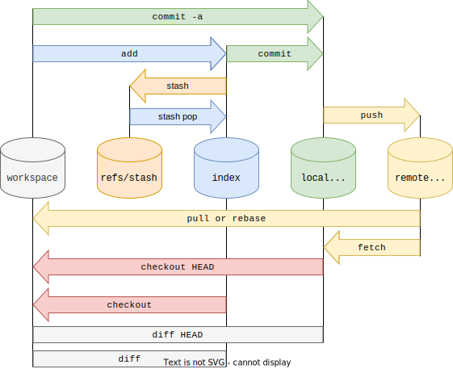

## 初始化

```bash
# 创建一个空的 Git 仓库或重新初始化一个已存在的 Git 仓库。
$ git init

# 新建一个目录，并将其初始化为一个 Git 仓库。
$ git init [directory]

# 下载一个项目和它的整个代码库
$ git clone [url]
```

## 配置

Git 的设置文件为 .gitconfig，它可以在用户主目录下（全局配置），也可以在项目目录下（项目配置）。

```bash
# 显示 Git 配置。
$ git config --list [--global]

# 编辑 Git 配置文件。
$ git config -e [--global]

# 设置提交时的用户的姓名。
$ git config [--global] user.name "xxx"

# 设置提交时的用户的邮箱。
$ git config [--global] user.email "xxx@xxx.com"

# 设置提交时自动将换行符转换为 lf。
git config --global core.autocrlf input
```

> 指定目录下引用指定 Git 配置文件。如指定 work 目录下应用配置文件 `.gitconfig-work`，
> 首先修改 `~/.gitconfig`
>
> ```bash
> [user]
>   name = xxx
>   email = xxx@xxx.com
> [includeIf "gitdir:~/work"]
>   path = .gitconfig-work
> ```
>
> 然后修改 `~/.gitconfig-work`，
>
> ```bash
> [user]
>   name = xx
>   email = xx@xx.work.com
> ```

## 记录更新到仓库

```bash
# 添加指定文件到暂存区。
$ git add [<file>...]

# 添加指定目录到暂存区，包括子目录。
$ git add [<pathspec>...]

# 添加当前目录的所有文件到暂存区。
$ git add .
$ git add -A

# 添加每个变化前，都会要求确认。（对于同一个文件的多处变化，可以实现分次提交。）
$ git add -p

# 停止追踪指定文件，但该文件会保留在工作区。
$ git rm --cached [file]

# 提交暂存区到仓库区。
$ git commit -m [message]

# 提交暂存区的指定文件到仓库区。
$ git commit [<file>...] -m [message]

# 提交工作区自上次 commit 之后的变化，直接到仓库区
$ git commit -a

# 使用一次新的 commit，替代上一次提交。（如果代码没有任何新变化，则用来改写上一次 commit 的提交信息。）
$ git commit --amend -m [message]

# 重做上一次 commit，并包括指定文件的新变化
$ git commit --amend [<file>...]
```

## 撤销

```bash
# 恢复暂存区的指定文件到工作区。
$ git checkout [file]

# 恢复某个 commit 的指定文件到暂存区和工作区。
$ git checkout [commit] [file]

# 恢复暂存区的所有文件到工作区。
$ git checkout .

#取消已经暂存的文件。
$ git reset HEAD

# 重置暂存区的指定文件，与上一次 commit 保持一致，但工作区不变。
$ git reset [file]

# 重置暂存区与工作区，与上一次 commit 保持一致
$ git reset --hard

# 重置当前分支的指针为指定 commit，同时重置暂存区，但工作区不变。
$ git reset [commit]

# 重置当前分支的 HEAD 为指定 commit，同时重置暂存区和工作区，与指定 commit 一致。
$ git reset --hard [commit]

# 重置当前 HEAD 为指定 commit，但保持暂存区和工作区不变。
$ git reset --keep [commit]

# 新建一个 commit，用来撤销指定 commit。
# 后者的所有变化都将被前者抵消，并且应用到当前分支。
$ git revert [commit]

# 撤销前一次操作（即新建一个 commit，用来撤销上一次提交）。
$ git revert HEAD

# 撤销前前一次操作（即新建一个 commit，用来撤销上上一次提交）。
$ git revert HEAD~
```

## 暂时将未提交的变化移除，稍后再移入

```bash
# 保存当前未 commit 的代码。
git stash

# 保存当前未 commit 的代码并添加备注。
git stash save "备注的内容"

# 列出 stash 的所有记录。
git stash list

# 删除 stash 的所有记录。
git stash clear

# 应用最近一次的 stash。
git stash apply

# 应用最近一次的 stash，随后删除该记录。
git stash pop

# 删除最近的一次 stash。
git stash drop 
```

## 查看信息

```bash
# 显示有变更的文件。
$ git status

# 显示当前分支的版本历史。
$ git log

# 图形化显示
$ git log --graph

# 显示 commit 历史，以及每次 commit 发生变更的文件。
$ git log --stat

# 搜索提交历史，根据关键词。
$ git log -S [keyword]

# 显示某个 commit 之后的所有变动，每个 commit 占据一行。
$ git log [commit] HEAD --pretty=format:%s

# 显示某个 commit 之后的所有变动，其”提交说明“必须符合搜索条件。
$ git log [commit] HEAD --grep feature

# 显示某个文件的版本历史，包括文件改名。
$ git log --follow [file]
$ git whatchanged [file]

# 显示指定文件相关的每一次 diff。
$ git log -p [file]

# 显示过去 5 次提交
$ git log -5 --pretty --oneline

# 显示所有提交过的用户，按提交次数排序。
$ git shortlog -sn

# 显示指定文件是什么人在什么时间修改过。
$ git blame [file]

# 显示暂存区和工作区的差异。
$ git diff

# 显示暂存区和目标提交的差异. 如果没有指定 commit，则默认和最近一次提交比较。
$ git diff --cached [commit]

# 显示工作区与当前分支最新 commit 之间的差异。
$ git diff HEAD

# 显示指定提交之间的差异. 如果没有指定 commit2，则比较指定提交与工作区的差异。
$ git diff [commit1] [commit2]

# 显示指定分支之间的差异，如果没有指定 branch2，则比较当前分支和指定分支间的差异。
$ git diff [branch1] [branch2]

# 显示今天你写了多少行代码。
$ git diff --shortstat "@{0 day ago}"

# 显示某次提交的元数据和内容变化。
$ git show [commit]

# 显示某次提交发生变化的文件。
$ git show --name-only [commit]

# 显示某次提交时，某个文件的内容。
$ git show [commit]:[filename]

# 显示当前分支的最近几次提交。
$ git reflog

#  查看暂存区追踪的文件。
$ git ls-files
```

## 分支管理

```bash
# 列出所有本地分支。
$ git branch

# 列出所有远程分支。
$ git branch -r

# 列出所有分支。
$ git branch -a

# 新建一个分支，但依然停留在当前分支。
$ git branch [branch]

# 新建一个分支，并切换到该分支。
$ git checkout -b [branch]

# 新建一个分支，指向指定 commit。
$ git branch [branch] [commit]

# 新建一个分支，与指定的远程分支建立追踪关系。
$ git branch --track [branch] [remote-branch]

# 切换到指定分支，并更新工作区。
$ git checkout [branch]

# 建立追踪关系，在现有分支与指定的远程分支之间。
$ git branch --set-upstream [branch] [remote-branch]

# 合并指定分支到当前分支。
$ git merge [branch]

# 合并指定分支到当前分支，将指定分支的 commit 压缩为一条。
$ git merge --squash [branch]

# 选择一个 commit，合并进当前分支。
$ git cherry-pick [commit]

# 重命名分支
$ git branch -m [old] [new]

# 删除分支。
$ git branch -d [branch]

# 将指定分支上超前的提交，变基到当前分支。
$ git rebase [branch]
```

## 标签

```bash
# 列出所有 tag。
$ git tag

# 新建一个 tag 在当前 commit。
$ git tag [tag]

# 新建一个 tag 在指定 commit。
$ git tag [tag] [commit]

# 删除本地 tag。
$ git tag -d [tag]

# 删除远程 tag。
$ git push origin :refs/tags/[tagName]

# 查看 tag 信息。
$ git show [tag]

# 提交指定 tag。
$ git push [remote] [tag]

# 提交所有 tag。
$ git push [remote] --tags

# 新建一个分支，指向某个 tag。
$ git checkout -b [branch] [tag]
```

## 与远程仓库的交互

```bash
# 下载远程仓库的所有变动。
$ git fetch [remote]

# 显示所有远程仓库。
$ git remote -v

# 显示某个远程仓库的信息。
$ git remote show [remote]

# 为本地仓库添加远程仓库，并命名。
$ git remote add [name] [url]

# 取回远程仓库的变化，并与本地分支合并。
$ git pull [remote] [branch]

# 上传本地指定分支到远程仓库。
$ git push [remote] [branch]

# 当第一次为本地分支推送时, 需要为本地分支设置跟踪的远程仓库，此时需要运行该命令。此后进行推送时, 将不再需要指定 `-u` 参数, 只需运行 `git push` 即可。
$ git push -u [remote]

# 强行推送当前分支到远程仓库，即使有冲突。
$ git push [remote] --force

# 推送所有分支到远程仓库。
$ git push [remote] --all

# 删除远程分支。
$ git push origin --delete [branch]
$ git branch -dr [remote/branch]
```

## 其他

```bash
# 生成一个可供发布的压缩包
$ git archive
```
